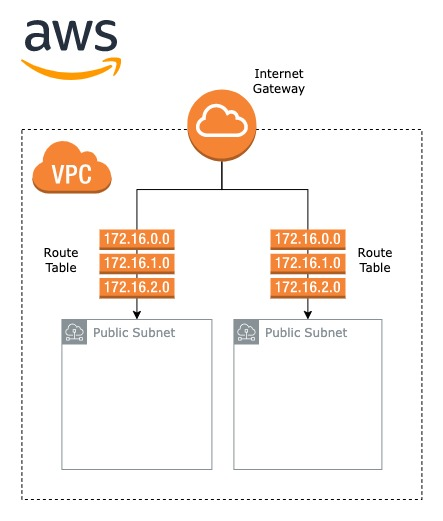

Deploying anything into AWS environments generally requires at least a VPC and serious of networks to be configured. While much of this can be done by AWS behind the scenes, deploying a custom, flexible network of applications (such as a mesh of AWS Fargate containers for instance) often requires this to be done manually. Understanding how VPC’s and AWS networking generally works under the hood also has its benefits. Having a (somewhat) deeper understanding of what’s actually going on when high-level API’s are generating infrastructure for you has helped me a great deal in the past when trying to figure out why my services can’t communicate or why my application can’t be accessed.

I’m going to be using Terraform with the AWS provider to generate a VPC and setup some public subnets that can then be used to deploy a dockerized application via AWS Fargate. It’s worth noting that it’s generally not recommended to deploy applications directly into a public subnet due to the obvious security implications (public subnets means public IP’s which means public access). However, deploying applications into private subnets is a bit more involved and usually involves introducing NAT gateways and Load Balancers for communication between private and public subnets. I’ll cover this use case in detail in a later blog post, but for now, let’s start with the basics.

## Architecture

I’m going to setup something that looks like the following



Basic AWS VPC and networking configuration

Once the subnets have been created, a wide range of applications and services can be deployed into them. While this blog only covers the creation of the VPC and networks themselves, deployment of applications is covered in detail in further posts (see links towards the end).

One thing that’s worth noting here is that the above is geared towards deploying containers into AWS Fargate. While it provides a fairly flexible setup, there are a plethora of ways that AWS networking can be configured and setup, and your specific use case may well require modifications.

## Provider Configuration

Before any infrastructure can be generated, the AWS Terraform provider needs to be configured. I would generally recommend using S3 and DynamoDB for state management and storage, but for sake of simplicity, I’m going to stick to a local configuration

```
terraform {
  required_providers {
    aws = {
      source  = "hashicorp/aws"
      version = "4.4.0"
    }
  }
}

provider "aws" {
  profile = var.aws_profile
  region  = var.aws_region
}
```

Note that in this case I’m using a profile setup in my AWS CLI configuration locally. The access key ID and secret can be passed directly to the provider, but its generally best security practices to use profiles where possible.

## VPC Configuration

Any AWS environment starts with a VPC (virtual private cloud). If you’ve not come across a VPC before, it’s essentially a way of isolating networking resources into a logic group. Resources such as subnets, internet gateways and load balancers are deployed into a particular VPC, all of which then form your virtual network. AWS generates a default VPC for all users, which is what resources are deployed into if you don’t explicitly define or create a VPC. If you want more info on VPC’s, check out the official AWS docs here.

Terraform makes creation of VPC’s easy. I define a variable for the CIDR blocks that the VPC encompasses as an array of strings and generate the VPC. 

```
variable "vpc_cidr" {
  type    = string
  default = "10.0.0.0/16"
}

resource "aws_vpc" "vpc" {
  cidr_block           = var.vpc_cidr
  enable_dns_hostnames = true
}
```

When defining your VPC CIDR block, ensure that your chosen range has enough available IP addresses for your needs. I generally stay on the safe side and use a /16 network, giving me a total of 64,000 IP addresses. While this may seem like overkill, be aware that any subnets that you define must fit into the provided VPC CIDR range, so it’s best to be conservative. 

One important thing to note that may not be immediately obvious is that, on its own, a VPC does not provide an ingress or egress into networks deployed into it (including egress traffic to the public internet). Some more networking resources are required to facilitate this.

## Internet Gateway

This is a really simple resource to define and generate, and it’s required to connect your networks to the wider internet. Simply put, the internet gateway connects your VPC to the outside world. All we need is the ID of the previously created VPC. 

```
resource "aws_internet_gateway" "gateway" {
  vpc_id = aws_vpc.vpc.id
}
```

Check out the official AWS docs on internet gateways here for more information.

## Configuration of Networks

Once the VPC is generated, it’s time to create our networks. To actually generate a working subnet, we need the following components

1. Network resource
2. Route tables
3. Route table routes
4. Route table route association

The first should be fairly self explanatory. No network, no dice. Route tables are where it starts getting a bit more involved. A route table is essentially a list of networking and routing rules that are used to route traffic within a network. Typically, each network (public and private) has a route table that determines how traffic can flow within said network. The route table routes are the individual rules that define the flow of traffic, and a route table route association links the route table route to a given route table and subnet. 

The Terraform configuration looks like the following. First we define a list of subnet CIDRS (make sure that the provided range falls into the VPC CIDR defined earlier). 

```
variable "public_subnet_cidrs" {
  type    = list(string)
  default = ["10.0.1.0/24", "10.0.2.0/24"]
}
```

The availability zones that the subnets are deployed into also need to be defined. Note that these will change depending on your AWS region. 

```
variable "availability_zones" {
  type    = list(string)
  default = ["eu-west-1a", "eu-west-1b"]
}
```

Then, we generate a subnet resource for each CIDR block 

```
resource "aws_subnet" "public_subnets" {

  # generate one subnet per defined
  # CIDR block and set in and select availabity zone
  count             = length(var.public_subnet_cidrs)
  cidr_block        = var.public_subnet_cidrs[count.index]
  availability_zone = var.availability_zones[count.index]

  vpc_id            = aws_vpc.vpc.id

  map_public_ip_on_launch = true
}
```

One thing worth noting at this stage is that the map public ip on launch variable is set to true. This ensures that all instances launched into the created subnet are given a public IP address.

Finally, we define our route table, rules and associations

```
# create new route table to manange newtork rules
resource "aws_route_table" "public_route_tables" {
  count    = length(var.public_subnet_cidrs)
  vpc_id   = aws_vpc.vpc.id
}

# create new route to map traffic from internet
# gateway to route table
resource "aws_route" "public_routes" {
  count                  = length(var.public_subnet_cidrs)
  # define route table definitions
  route_table_id         = aws_route_table.public_route_tables[count.index].id
  # define destination configurations. note that
  # all networks are used for the the destination block
  destination_cidr_block = "0.0.0.0/0"
  gateway_id             = aws_internet_gateway.gateway.id
}

# create new association between public subnet and route table
resource "aws_route_table_association" "public_route_ascs" {
  count          = length(var.public_subnet_cidrs)
  subnet_id      = aws_subnet.public_subnets[count.index].id
  route_table_id = aws_route_table.public_route_tables[count.index].id
}
```

Couple of important things to mention here. First, note that the destination CIDR block for all of our routes is set to 0.0.0.0/0, allowing traffic to all IP addresses within the subnet. Additionally, all AWS route instances are linked to the Internet Gateway previously defined via the `gateway_id` argument. 

If you want to do some more reading on Route Tables, AWS offer docs here.

## Finishing Up

Running the above terraform setup gives you a basic VPC setup with a collection of subnets. Once these subnets are defined, ECS instances can be deployed into them via the ID’s generated for the VPC and subnets. This usually involves deploying a load balancer within the public subnets to received traffic, which can then be routed to a specified ECS service.

One thing that’s worth considering is the number of subnets that are created. This becomes particularly important when defining load balancers as they often need to be deployed into more than one availability zone (application load balancers need to be deployed in at least two, for example). As a result, I usually create at least 2 public subnets when deploying applications like this, each in a different availability zone.

That’s it for today! If you found this useful, be sure to checkout my follow up blog posts that cover creation of private subnets via NAT gateways and deployment of ECS Fargate instances using the concepts discussed in this post.