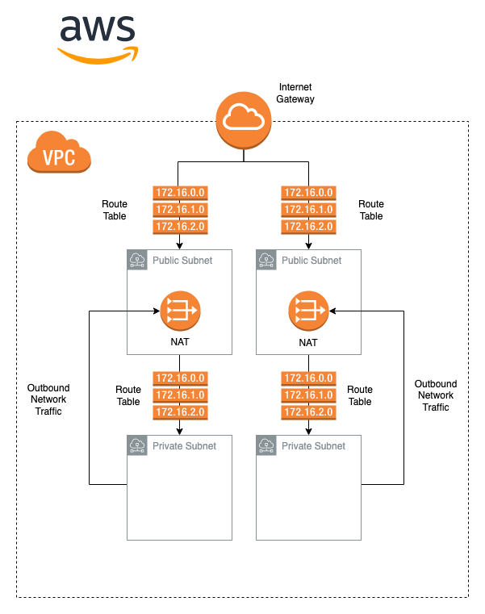

In the previous blog post, I went over a basic VPC and networking setup that I commonly use to deploy applications into AWS via ECS Fargate. It involved generating a VPC and 2 subnets, which where made available via an internet gateway. One of the major drawbacks to this approach is that the subnets where essentially public, which is generally not a great idea from a security perspective.

A far more robust approach is to create an environment consisting of both public and private subnets. The public subnets are still required for some resources, particularly the AWS ALB (load balancer) resources that can be used to route traffic to ECS services. But the containers and ECS services themselves should sit in a private subnet with IP addresses that are not public. Schematically, this looks something like the following



The first half of the diagram looks similar to the previous setup. An AWS VPC with two public subnets with connection to the internet via an internet gateway. Routing in each subnet is controlled by a route table. However, two private subnets (each with their own route table) have now also been added to the virtual network. Crucially, the AWS routes present in the route tables for the private subnets are not bound to the internet gateway. Instead, they are bound to a NAT gateway within the public subnet. 

In this case, the NAT gateway serves a similar function to the internet gateway. It allows instances within our subnet to access the internet, with two critical differences

Instances do not require a public IP to access the internet via the NAT gateway

Connection through a NAT gateway is not bi-directional i.e. only outbound traffic from the private subnet is allowed

These two properties of the NAT gateway make services that are deployed in out private subnets far more secure than the ones deployed in our public subnets because we do not require them to have a public IP address. If you want to read more about it, check out the AWS docs here, which give a good high-level overview of the basics of NAT gateways.

Lets get started with some Terraform

## Provider Configuration

As always, first thing is to configure our AWS provider (I use an AWS CLI profile here for configuration)

```
terraform {
  required_providers {
    aws = {
      source  = "hashicorp/aws"
      version = "4.4.0"
    }
  }
}

provider "aws" {
  profile = var.aws_profile
  region  = var.aws_region
}
```

## VPC and Public Subnets

The VPC and public subnet configuration is the same as before, so I won’t go over it in detail. For a more detailed walkthrough, check out my previous post here.

```
variable "vpc_cidr" {
    type    = string
    default = "10.0.0.0/16"
}

variable "public_subnet_cidrs" {
    type    = list(string)
    default = ["10.0.1.0/24", "10.0.2.0/24"]
}

variable "availability_zones" {
    type    = list(string)
    default = ["eu-west-1a", "eu-west-1b"]
}

resource "aws_vpc" "vpc" {
  cidr_block           = var.vpc_cidr
  enable_dns_hostnames = true
}

resource "aws_internet_gateway" "gateway" {
  vpc_id = aws_vpc.vpc.id
}

# create public AWS subnet for external applications
resource "aws_subnet" "public_subnets" {

  # generate one subnet per defined
  # CIDR block and set in and select availabity zone
  count             = length(var.public_subnet_cidrs)
  cidr_block        = var.public_subnet_cidrs[count.index]
  availability_zone = var.availability_zones[count.index]

  vpc_id            = aws_vpc.vpc.id

  map_public_ip_on_launch = true
}

output "public_subnet_ids" {
  value = aws_subnet.public_subnets.*.id
}

# create new route table to manange newtork rules
resource "aws_route_table" "public_route_tables" {
  count    = length(var.public_subnet_cidrs)
  vpc_id   = aws_vpc.vpc.id
}

# create new route to map traffic from internet
# gateway to route table
resource "aws_route" "public_routes" {
  count                  = length(var.public_subnet_cidrs)
  # define route table definitions
  route_table_id         = aws_route_table.public_route_tables[count.index].id
  # define destination configurations. note that
  # all networks are used for the the destination block
  destination_cidr_block = "0.0.0.0/0"
  gateway_id             = aws_internet_gateway.gateway.id
}

# create new association between public subnet and route table
resource "aws_route_table_association" "public_route_ascs" {
  count          = length(var.public_subnet_cidrs)
  subnet_id      = aws_subnet.public_subnets[count.index].id
  route_table_id = aws_route_table.public_route_tables[count.index].id
}
```

## NAT Gateways

The next step is to generate the NAT gateways.  Note that we generate a single NAT gateway for each of our public subnets

```
resource "aws_eip" "nat" {
  count = length(var.public_subnet_cidrs)
  vpc   = true
}

resource "aws_nat_gateway" "nat_gateway" {
  count         = length(var.public_subnet_cidrs)
  allocation_id = aws_eip.nat[count.index].id

  subnet_id     = aws_subnet.public_subnets[count.index].id
  depends_on    = [aws_internet_gateway.gateway]
}
```

Notice that the NAT gateway requires an AWS EIP resource (which stands for Elastic IP address). While the instances connected to the internet via the NAT gateway don’t need a public IP address, the NAT gateway itself does. The AWS EIP provides the public IP address which allows the NAT gateway to connect to the wider internet via the Internet Gateway.

## Private Subnets

Once the NAT gateways are created, we can generate our private subnets. The Terraform configuration for this is very similar to that of the public subnets. The only real difference is in the AWS route resources, which take the NAT gateway ID as an argument instead of the Internet Gateway

```
variable "private_subnet_cidrs" {
    type    = list(string)
    default = ["10.0.3.0/24"]
}

resource "aws_subnet" "private_subnets" {

  # generate one subnet per defined
  # CIDR block and set in and select availabity zone
  count             = length(var.private_subnet_cidrs)
  cidr_block        = var.private_subnet_cidrs[count.index]
  availability_zone = var.availability_zones[count.index]

  vpc_id            = aws_vpc.vpc.id
}
```

Once we have our actual subnets created, we need to generate the route tables, rules and associations to define the traffic rules for out subnets just as we did with the public network

```
resource "aws_route_table" "private_route_tables" {
  count    = length(var.private_subnet_cidrs)
  vpc_id   = aws_vpc.vpc.id
}

# generate routes for route tables
resource "aws_route" "private_route" {
  # define route table definitions
  count                  = length(var.private_subnet_cidrs)
  route_table_id         = aws_route_table.private_route_tables[count.index].id
  # define destionation configurations
  destination_cidr_block = "0.0.0.0/0"

  nat_gateway_id         = aws_nat_gateway.nat_gateway[count.index].id
}

resource "aws_route_table_association" "private_route_asc" {
  # iterate over each index
  count          = length(var.private_subnet_cidrs)
  # get subnet ID and route table ID from index
  subnet_id      = aws_subnet.private_subnets[count.index].id
  route_table_id = aws_route_table.private_route_tables[count.index].id
}
```

One important thing to note here is that, for this particular setup, we need at least as many public subnets as we have private subnets, since each of our private subnets effectively has its own NAT gateway. If you are concerned about costs, you can technically get away with routing all traffic through a single NAT gateway, but having more in different availability zones makes your network more robust, secure and less error prone.

## Food for Thought

One major downside to using NAT gateways is the cost. EC2 costs can go up significantly when using NAT gateways because of the AWS Elastic IP addresses. If you deploy ECS services with the above setup and you see a spike in EC2 - Other service cost, that’s most likely the EIP addresses. Security comes at a price! What’s worth noting here is that the cost doesn’t scale with the number of containers you run, because they all use the same NAT gateway. This effectively means that the cost can be large if you are running 2-3 containers, but starts becoming smaller and smaller as you run more and more ECS instances.

Thats it! Once your terraform setup is configured, you’ll have a VPC setup with private and public subnets. In my next blog post, I’ll go over the deployment of an ECS service into one of the private subnets, so make sure to check that out next to make use of your new subnets.