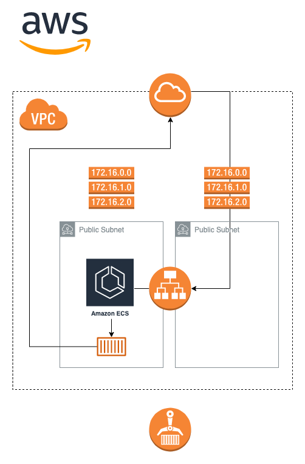

In previous blogs posts, I discussed multiple ways of configuring an AWS VPC and set of subnets. In this post, I’m going to show you how to actually make use of the generated subnets to host a docker container within ECS. I’m going to be using AWS Fargate for my computing engine. If you aren’t familiar with AWS Fargate, it’s an easy (and cheap) way to run Docker containers within AWS ECS (Elastic Container Services). 

The major upside to using Fargate over the more traditional container instances is that you don’t need to pay for an entire EC2 instances to host your containers. You only pay for the computing resource that your individual containers use. For more info, see the official AWS docs <a href="https://docs.aws.amazon.com/AmazonECS/latest/userguide/what-is-fargate.html">here</a>.

## Architecture

Before we get started, theres a couple of pre-requisites that are required. Rather than creating all the required VPC and networking components, I'm going to deploy the ECS services into an existing network using the VPC and subnet ID's directly. I've covered setup of VPC's and subnets in detail in previous posts <a href="">here</a> (public case) and <a href="">here</a> (private case). Check those out if you don't already have the required infrastructure setup. In addition to the VPC and subnets, you'll need a certificate issued by AWS for the assigned subdomain for the load balancer. See <a href="https://docs.aws.amazon.com/acm/latest/userguide/acm-overview.html">here</a> for documentation on certificate management within AWS via ACM.

Schematically, the setup is going to look something like the following



Note that I'm deploying the actual ECS services into a private subnet connected to a NAT gateway. However, the same setup works for a public subnet as well, with a few minor changes in variable values. Most notably, you'll need to give the ECS service a public IP address. I'll cover this in more detail when we get to it.

## Provider Configuration

First, the AWS provider is configured. As usual, I use the credentials already configured via the AWS CLI.

```terraform
terraform {
  required_providers {
    aws = {
      source  = "hashicorp/aws"
      version = "4.4.0"
    }
  }
}

provider "aws" {
  region  = var.aws_region
}
```

## Data Sources

Because we are using existing AWS resources (VPC and subnets), I'm going to introduce a few Terraform data sources to fetch the resources that already exist. 

```terraform
variable "vpc_id" {
  type        = string
  description = "ID of VPC to deploy application into"
}

variable "public_subnet_ids" {
  type        = list(string)
  description = "List of subnet ID's for public subnets"
}

variable "private_subnet_ids" {
  type        = list(string)
  description = "List of subnet ID's for private subnet"
}
```

Followed by the data definitions themselves (one for the VPC and two for each the public/private subnet sets)

```terraform
data "aws_vpc" "main" {
  id = var.vpc_id
}

data "aws_subnet" "public" {
  count = length(var.public_subnets_ids)
  id    = var.public_subnet_ids[count.index]
}

data "aws_subnet" "private" {
  count = length(var.private_subnets_ids)
  id    = var.public_subnet_ids[count.index]
}
```

## Application Load Balancer

Next, I define the application load balancer, which receives HTTPS traffic from the Internet Gateway, which is then routed to the ECS service. The complete load balancer setup consists of a few different components

1. ALB -  the actual load balancer itself
2. 2 ALB listeners - resources that listen on specific ports for traffic over a particular protocol (one each for HTTP/S)
3. Target group - target resources for traffic received by the listener. The target group is effectively what links the ALB to the ECS service

If you aren't familiar with the ALB terminology, I would recommend AWS docs for <a href="https://docs.aws.amazon.com/elasticloadbalancing/latest/application/load-balancer-listeners.html">listeners</a> and <a href="https://docs.aws.amazon.com/elasticloadbalancing/latest/application/load-balancer-target-groups.html">target groups</a>. The tl;dr explanation is that listeners check for connection attempts on the load balancer, while target groups route the traffic to specific targets (the ECS service in this case).

```terraform
variable "availability_zones" {
  type        = list(string)
  default     = ["eu-west-1a", "eu-west-1b"]
  description = "List of availability zones to use for Application Load Balancer"
}

variable "certificate_arn" {
  type        = string
  description = "ARN of ACM certificate"
}
```

One important thing to note here is that the application load balancer requires at least 2 availability zones to be deployed. This effectively means that you need at least 2 public subnets. Along with the load balancer, a security group is generated to define the allowed traffic rules. In this case, all HTTP/S traffic is enabled on ports 80/443 respectively, and egress traffic is allowed to all sources and protocols.

```terraform
resource "aws_lb" "main" {

  name               = "example-app-alb"
  internal           = false
  load_balancer_type = "application"
  security_groups    = [aws_security_group.alb.id]

  # add private and public subnets to loadbalancer
  subnets                    = data.aws_subnet.public.*.id
  drop_invalid_header_fields = true
}

resource "aws_security_group" "alb" {
  name        = "example-app-sg-alb"
  vpc_id      = data.aws_vpc.main.id
  description = "Allow access to ALB over HTTP port 80, HTTPS port 443 and allow all egress"

  ingress {
    protocol         = "tcp"
    from_port        = 80
    to_port          = 80
    description      = "Allow ingress to HTTP port over all routes"
    cidr_blocks      = ["0.0.0.0/0"]
    ipv6_cidr_blocks = ["::/0"]
  }

  ingress {
    protocol         = "tcp"
    from_port        = 443
    to_port          = 443
    description      = "Allow ingress to HTTPS port over all routes"
    cidr_blocks      = ["0.0.0.0/0"]
    ipv6_cidr_blocks = ["::/0"]
  }

  egress {
    protocol         = "-1"
    from_port        = 0
    to_port          = 0
    description      = "Allow egress to all sources"
    cidr_blocks      = ["0.0.0.0/0"]
    ipv6_cidr_blocks = ["::/0"]
  }
}
```

Next, the ALB listeners are defined. One is defined for each HTTP and HTTPS traffic. However, the HTTP listeners only function is to upgrade incoming HTTP connections to HTTPS, which it does by re-directing the request to the HTTPS listener. This prevents clients from instantiating plain (and insecure) HTTP connections.

```terraform
resource "aws_alb_listener" "http" {
  load_balancer_arn = aws_lb.main.id
  port              = 80
  protocol          = "HTTP"

  default_action {
    type = "redirect"

    redirect {
      port        = 443
      protocol    = "HTTPS"
      status_code = "HTTP_301"
    }
  }
}

resource "aws_alb_listener" "https" {

  load_balancer_arn = aws_lb.main.id
  port              = 443
  protocol          = "HTTPS"
  # set certificate ARN
  certificate_arn = var.certificate_arn
  ssl_policy      = "ELBSecurityPolicy-TLS-1-2-2017-01"

  default_action {
    target_group_arn = aws_alb_target_group.http.id
    type             = "forward"
  }
}
```

Note that in order to create a HTTPS listener, you need a valid TLS certificate in ACM, otherwise Terraform will throw an error.

Finally, the target group is defined. Because I'm deploying a plain NGINX instance, the configured health check is set to `/` at port `80`. Generally, when I write an API I usually include a `/health_check` endpoint, which I would then use here. Change this to match whatever suits your application. Note that you can also set the expected HTTP code via the `matcher` field i.e. if you don't have an endpoint that suits a health check, you can also just set it to `/` and set the `matcher` to `404`.

```terraform
resource "aws_alb_target_group" "http" {
  name        = "example-app-tg-api"
  port        = 80
  protocol    = "HTTP"
  vpc_id      = data.aws_vpc.main.id
  target_type = "ip"

  health_check {
    healthy_threshold   = "3"
    interval            = "120"
    protocol            = "HTTP"
    matcher             = "200"
    timeout             = "3"
    path                = "/"
    unhealthy_threshold = "2"
  }
}
```

You might notice that the target group actually has no reference to the target (in this case the ECS service). This is intentional. When using Terraform, the target group is attached to the ECS in the `aws_ecs_service` resource. Alternatively, you can create an `aws_lg_target_group_association` resource to do this manually.

## IAM Policies

Usually 2 IAM roles are used to deploy a fargate container. The first is known as the execution role, the second as the task role. The execution role is what is used to call other AWS services and API's when creating the ECS service and containers (including ECR), while the task role is the role that runs the actual container process itself. Check out <a href="https://stackoverflow.com/questions/48999472/difference-between-aws-elastic-container-services-ecs-executionrole-and-taskr">this</a> stack overflow thread for some good explanations.

In terraform, we create both the execution and task roles

```terraform
resource "aws_iam_role" "ecs_task_role" {
  name = "example-app-ecsTaskRole"

  assume_role_policy = <<EOF
{
 "Version": "2012-10-17",
 "Statement": [
   {
     "Action": "sts:AssumeRole",
     "Principal": {
       "Service": "ecs-tasks.amazonaws.com"
     },
     "Effect": "Allow",
     "Sid": ""
   }
 ]
}
EOF
}

resource "aws_iam_role" "ecs_task_execution_role" {
  name = "example-app-ecsTaskExecutionRole"

  assume_role_policy = <<EOF
{
 "Version": "2012-10-17",
 "Statement": [
   {
     "Action": "sts:AssumeRole",
     "Principal": {
       "Service": "ecs-tasks.amazonaws.com"
     },
     "Effect": "Allow",
     "Sid": ""
   }
 ]
}
EOF
}
```

Next, I'm going to create two further IAM policies to attach to the role. One gives the execution role permissions to generate a log group which the ECS services will populate with logs. The second gives the execution role permissions to pull containers images from a private ECR within the same account

```terraform
resource "aws_iam_policy" "logs" {
  name        = "example-app-task-policy-logs"
  description = "Policy that allows access to log stream"

  policy = <<EOF
{
   "Version": "2012-10-17",
   "Statement": [
       {
            "Effect": "Allow",
            "Action": [
                "logs:GetLogEvents",
                "logs:PutLogEvents"
            ],
            "Resource": "arn:aws:logs:*:*:*"
        },
        {
            "Effect": "Allow",
            "Action": [
                "logs:CreateLogStream",
                "logs:DescribeLogStreams",
                "logs:PutRetentionPolicy",
                "logs:CreateLogGroup"
            ],
            "Resource": "arn:aws:logs:*:*:*"
        }
   ]
}
EOF
}

resource "aws_iam_role_policy_attachment" "log_access" {
  role       = aws_iam_role.ecs_task_execution_role.name
  policy_arn = aws_iam_policy.logs.arn
}

resource "aws_iam_policy" "ecr" {
  name        = "example-app-task-policy-ecr"
  description = "Policy that allows access to ECR containers"

  policy = <<EOF
{
    "Version": "2012-10-17",
    "Statement": [
        {
            "Effect": "Allow",
            "Action": [
                "ecr:GetAuthorizationToken",
                "ecr:BatchCheckLayerAvailability",
                "ecr:GetDownloadUrlForLayer",
                "ecr:GetRepositoryPolicy",
                "ecr:DescribeRepositories",
                "ecr:ListImages",
                "ecr:DescribeImages",
                "ecr:BatchGetImage",
                "ecr:GetLifecyclePolicy",
                "ecr:GetLifecyclePolicyPreview",
                "ecr:ListTagsForResource",
                "ecr:DescribeImageScanFindings"
            ],
            "Resource": "*"
        }
    ]
}
EOF
}

resource "aws_iam_role_policy_attachment" "ecr_access" {
  role       = aws_iam_role.ecs_task_execution_role.name
  policy_arn = aws_iam_policy.ecr.arn
}
```

## ECS Services

Finally, all thats left is to generate the ECS services themselves. First off, I create an ECS cluster for services and tasks

```terraform
resource "aws_ecs_cluster" "main" {
  name = "example-app-cluster"

  setting {
    name  = "containerInsights"
    value = "enabled"
  }
}
```

Then I generate a security group for the ECS services and tasks. One important aspect to notice is that, unlike the security group that was defined for the load balancer, the ingress block(s) on the ECS security group do not allow access from all IP addresses. Instead, access is restricted to resources belonging to the ALB security group. Essentially, this means that only traffic that originates from the load balancer is allowed to the ECS service. Note that this is especially important when using a public subnet as it prevents public access to the ECS service.

```terraform
resource "aws_security_group" "ecs_tasks" {
  name        = "example-app-sg-task"
  vpc_id      = data.aws_vpc.main.id
  description = "Allow access from ALB sg to port 80 and allow all egress traffic"

  ingress {
    protocol        = "tcp"
    from_port       = 80
    to_port         = 80
    description     = "Allow ingress to HTTP port on ECS tasks from load balancer"
    security_groups = [aws_security_group.alb.id]
  }

  egress {
    protocol         = "-1"
    from_port        = 0
    to_port          = 0
    description      = "Allow egress to all sources"
    cidr_blocks      = ["0.0.0.0/0"]
    ipv6_cidr_blocks = ["::/0"]
  }
}
```

Next, the ECS task definition is generated. The task definition defines the actual application and the container that is going to be served. In this case, I'm justing using an NGINX instance listening on port `80`. Simply replace the `image` field in the `container_definitions` section to use a different image.

```terraform
resource "aws_ecs_task_definition" "main" {

  family = "example-app"

  network_mode             = "awsvpc"
  requires_compatibilities = ["FARGATE"]

  # define resouces for each task
  cpu    = 256
  memory = 512

  execution_role_arn = aws_iam_role.ecs_task_execution_role.arn
  task_role_arn      = aws_iam_role.ecs_task_role.arn

  container_definitions = jsonencode([{
    name      = "example-app-api"
    image     = "nginx:latest"
    essential = true

    "environment" : [
      {
        "name" : "BUILD",
        "value" : "v0.1.0"
      }
    ]
    "logConfiguration" : {
      "logDriver" : "awslogs",
      "options" : {
        "awslogs-group" : "awslogs-example-app-api",
        "awslogs-region" : "${var.aws_region}",
        "awslogs-stream-prefix" : "example-app-api",
        "awslogs-create-group" : "true"
      }
    }
    healthCheckGracePeriodSeconds = 60
    portMappings = [
      {
        protocol      = "tcp"
        containerPort = 80
        hostPort      = 80
      }
    ]
  }])
}
```

Finally, the ECS service itself is defined

```terraform
resource "aws_ecs_service" "main" {

  name    = "example-app-api"
  cluster = aws_ecs_cluster.main.id

  # add container tasks to ecs service
  task_definition     = aws_ecs_task_definition.main.arn
  desired_count       = 1
  launch_type         = "FARGATE"
  scheduling_strategy = "REPLICA"

  network_configuration {
    security_groups  = [aws_security_group.ecs_tasks.id]
    subnets          = data.aws_subnet.private.*.id
    assign_public_ip = false
  }

  # attach ecs service to loadbalancer to control traffic
  load_balancer {
    target_group_arn = aws_alb_target_group.http.arn
    container_name   = "example-app-api"
    container_port   = 80
  }
}
```

Three important things to note here

1. The `aws_security_group.ecs_tasks` SG is used for the ECS service
2. The target group we defined earlier is linked to the ECS service via the `load_balancer` block
3. The private subnet ID's are passed as arguments to the `network_configuration_block`

One important variable that's worth mentioning at this point is the `assign_public_ip` in the `network_configuration` block. By default, I've have set this to false because I'm using a private subnet, so the egress to the internet is provided by the NAT gateways I have deployed. However, if you are using a public subnet, this __must__ be set to true, else the Fargate task will have no internet access, which includes access to the image repository you are pulling containers from.

That's all for the today. The above should act as a template for Fargate applications. Swap out image repo URL's and ports for your specific use case and enjoy!